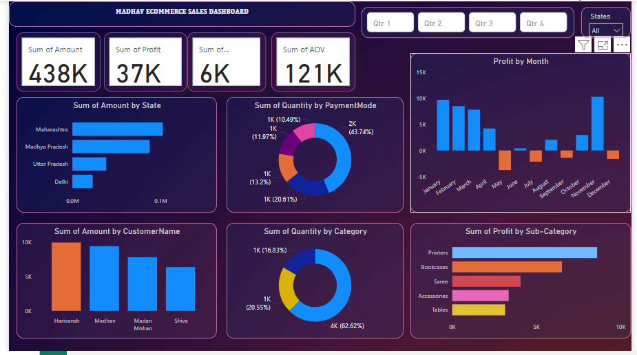

# 📊 Madhav Ecommerce Sales Dashboard

Welcome to my **Power BI Dashboard** project!  
In this project, I built an interactive **Ecommerce Sales Dashboard** using **Power BI** to visualize key sales metrics.

## 🚀 Project Overview

This dashboard allows users to explore ecommerce sales data dynamically.  
Users can filter the information based on **State** or **Quarter** to get more specific insights about the business performance.

The dashboard is created based on ecommerce sales data provided in the `sales-data.csv` file.

## 🛠️ Tools Used

- **Power BI Desktop**
- **Data Source:** CSV file (`sales-data.csv`)

## 📈 Dashboard Features

- 📍 **Filter by State** and **Quarter** dynamically
- 💰 **Total Amount**, **Profit**, **Order Quantity**, and **Average Order Value (AOV)**
- 🗓️ **Monthly Profit Trend** visualization
- 🏷️ **Top Customers**, **Product Categories**, and **Sub-Categories** performance
- 📊 Interactive bar charts, donut charts, and KPIs
- 🎨 Visually appealing design with an easy-to-use layout

## 📷 Dashboard Screenshot

## 📂 How to Open the Project

1. Download the `.pbix` and `.csv` files from this repository.
2. Open the `madhav-ecommerce-sales-dashboard.pbix` file using **Power BI Desktop**.
3. If the file asks for a data connection, load the `sales-data.csv` file.
4. Explore the slicers and visuals to analyze the sales data!

## ✨ What I Learned

- Creating interactive dashboards with slicers and filters
- Advanced data modeling and relationships in Power BI
- Designing user-friendly and professional-looking dashboards
- Using DAX for calculated fields

## 📬 Contact

Feel free to connect with me!

- Email: [deeksha2005agarwal@gmail.com]

---

